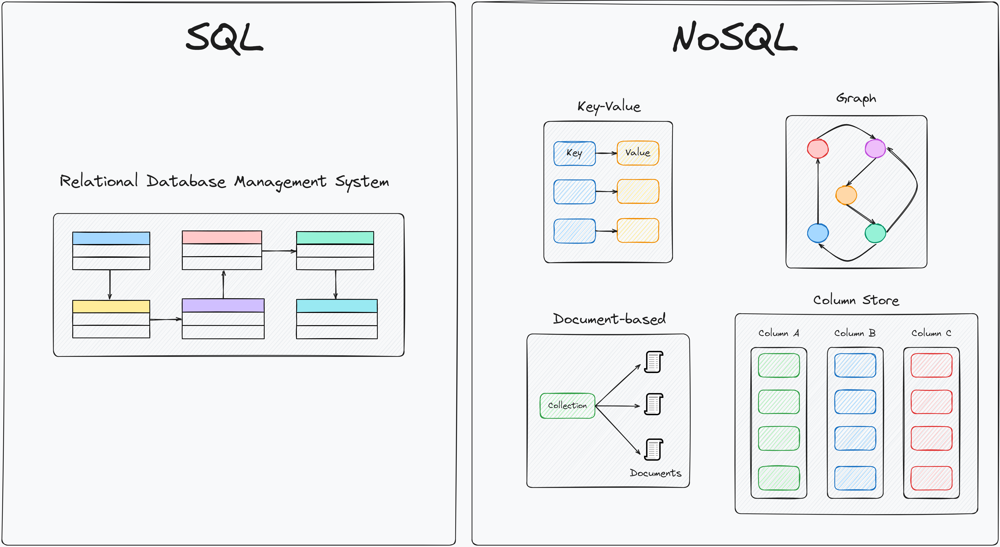

# DBs Types

# Database Types 🗂️

In this section of the course, we'll explore the different types of databases used to store, manage, and retrieve data. While relational databases are often the most commonly discussed, it’s important to understand that databases come in a variety of forms, each designed to handle different use cases with its own advantages and limitations. By knowing the different types, you can make more informed decisions when choosing a database solution for a specific problem.

In the real world, you’ll most likely encounter the following types:

- *Relational* databases *🔗*
- *Key-value* databases 🔑
- *Document-oriented* databases 📄

Besides, all types from above can be classified again into 2 main categories again:

- *SQL* → Relational databases
- *noSQL* → Key-value, Document-oriented, Graph, …

The picture below demonstrates the main database types:

