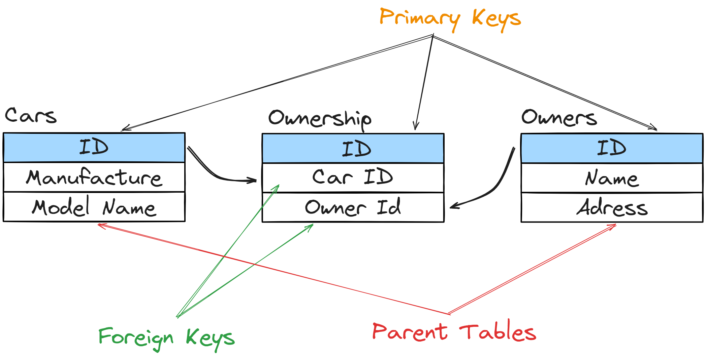

# Relational DBs Structure

# Relational DBs Structure 🏛️

*Relational databases (RDBMS)* are based on tables, where data is organized into rows and columns. Each table represents a set of data related to a specific entity, such as customers, orders, or products. Relationships between these tables are established using *keys* - *primary* and *foreign*.

<aside>
💡

**Primary** and **Foreign Keys** allow data to be easily combined and manipulated

</aside>

# **Table Structure 📝**

In relational databases, information is stored in related tables. Each table consists of:

- **Rows →**  called "records"
- **Columns →** called "fields" or "attributes"

Each column in a table must have predefined data type. The main reason → *Data Integrity and Consistency*. It ensures that only valid and consistent data is stored in that column. Below you can see what data types can be defined:

- `INTEGER` → numeric data type 🔢
- `VARCHAR` → string data type ✏️
- `DATETIME` → date and time data type 📅

A column defined as `INTEGER` will only accept numeric values, preventing errors like inserting text into a numeric field.

<aside>
💡

Each **Column** must have fixed data type (e.g. *integer*, *varchar*, …)

</aside>

# **Primary Key** 🔑

<aside>
📖

**Primary Key** — **unique** identifier for each record in a table. It ensures data integrity by ensuring that each row can be uniquely identified, preventing duplication and confusion

</aside>

When defining a *primary key*, it is important to select columns that contain unique values for each record. Typically, primary keys are based on one or more attributes of a table, for example:

- `user_id`, `order_id` , `product_id` , …

# Primary Key Properties 🎨

Since *Primary Key* is an important concept in SQL, let’s have a look at its main properties:

| **Property** | **Description** |
| --- | --- |
| *Uniqueness* | Each primary key value must be unique within the table, ensuring that no two rows can have the same primary key. |
| *Non-null Requirement* | Primary keys cannot contain *NULL* values. Every record must have a valid primary key value. |
| *Immutable* | Primary key values should remain constant over time to avoid complications with relationships and data inconsistencies. |
| *Performance Considerations* | Primary keys are often indexed, enhancing the performance of queries that retrieve records using the primary key. |
| *Foreign Key Relationships* | Primary keys are essential for establishing relationships between tables, with foreign keys referencing them. |
| *Best Practices for Selection* | Choose attributes that are stable, simple, and meaningful (e.g., auto-incrementing ID). |
| *Database Constraints* | Defining a primary key involves setting constraints that enforce uniqueness and non-nullability in the database system. |

When defining a *primary key*, you might choose columns like:

- *UserID:*
    - A unique identifier for users in a user table (e.g., auto-incrementing integer).
- *Email:*
    - A unique email address in a contacts table, assuming no two users can have the same email.
- *OrderID***:**
    - A unique identifier for each order in an orders table, ensuring that each order can be traced back without ambiguity.

Including these additional points will provide a more comprehensive understanding of primary keys and their significance in relational databases.

# Foreign Key 🗝️

<aside>
📖

**Foreign Key** — reference to the *primary key* of another table, ensuring data integrity and establishing logical relationships between different entities

</aside>

The main purpose of a *foreign key* is to maintain *links* between tables, which avoids duplication of data and makes it easier to manage. For example, “*Ownership”* table might contain a f*oreign key* that references the *primary key of the “Cars”* table*,* making it easy to retrieve information about the customer who placed the order:

<aside>
💡

- **Child Table** — table that contains a *foreign key*
- **Parent Table** — table with a *primary key* referencing another table
</aside>

Thus, when records are created in the *child table*, the *foreign key* value must exist in the *parent table*

# Foreign Key Properties 🎨

*Foreign Key* is an important concept in SQL as well, let’s have a look at its main properties:

| **Property** | **Description** |
| --- | --- |
| *Establish Relationships* | Links two tables by referencing the *primary key* of another table. |
| *Referential Integrity* | Ensures data consistency by preventing invalid or orphaned records in the *foreign key* table. |
| *Must Reference Primary Key* | *Foreign key* must reference the *primary key* (or unique key) in the related table. |
| *Can Be NULL* | Allows optional relationships where a record may not need a corresponding value in the other table. |
| *Cascade Actions* | Supports cascading updates or deletions (e.g., automatically deleting related records). |
| *Multiple Foreign Keys* | A table can reference multiple other tables through multiple *foreign keys*. |
| *Prevents Inconsistent Data* | Ensures that only valid references are inserted into the *foreign key* column |
| *Slower Inserts/Updates* | Can slow down data insert or update operations due to integrity checks, especially with large data. |